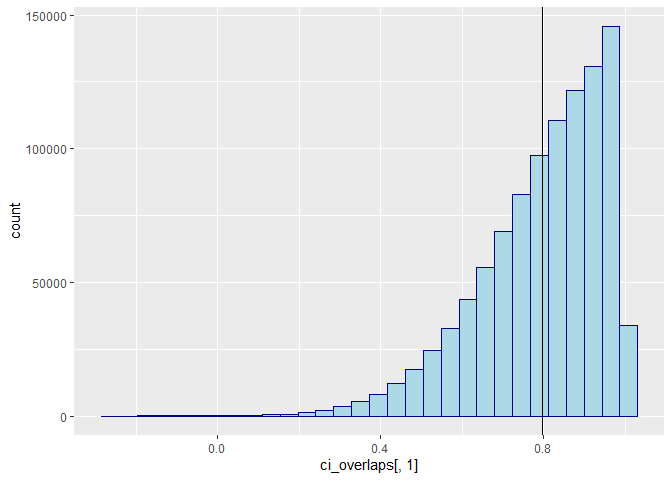
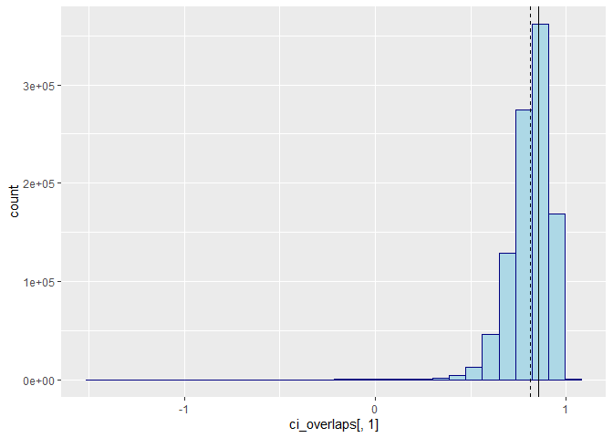
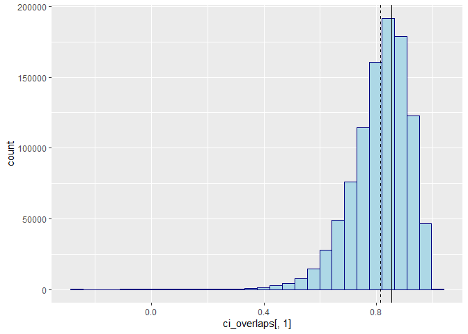

# What is the expected confidence interval overlap under a correct
synthesis model?

``` r
ci_overlap <- function(obs_l, obs_u, syn_l, syn_u) {
  obs_ol <- (min(obs_u, syn_u) - max(obs_l, syn_l)) / (obs_u - obs_l)
  syn_ol <- (min(obs_u, syn_u) - max(obs_l, syn_l)) / (syn_u - syn_l)
  (obs_ol + syn_ol) / 2
}

set.seed(123)

nsim <- 1000000
n <- 1000

sim_ci <- function(n) {
  obs <- rnorm(n)
  syn <- rnorm(n, mean(obs), sd(obs))
  ci_obs <- confint(lm(obs ~ 1))
  ci_syn <- confint(lm(syn ~ 1))
  cio <- ci_overlap(
    ci_obs[1, 1],
    ci_obs[1, 2],
    ci_syn[1, 1],
    ci_syn[1, 2]
  ) 
  c(cio = cio, 
    muo = mean(obs), 
    mus = mean(syn), 
    sdo = sd(obs), 
    sds = sd(syn),
    lo = ci_obs[1,1],
    uo = ci_obs[1,2],
    ls = ci_syn[1,1],
    us = ci_syn[1,2])
}

cl <- parallel::makeCluster(18)
parallel::clusterExport(cl, list("sim_ci", "n", "ci_overlap"))
#pbapply::pboptions(type = "none")
pbapply::pboptions(type = "timer")
ci_overlaps <- pbapply::pbreplicate(nsim, sim_ci(n), cl = cl) |>
  matrix(9) |>
  t()
parallel::stopCluster(cl)
```

Consider two CI’s, one for the observed data and one for the synthetic
data. We can consider the observed data CI fixed, as the synthetic data
is always generated with the parameters of the observed data.
Accordingly, the expected CI of the observed data is equal to
$0 \pm 1.96 * s / \sqrt{n}$. The expected CI of the synthetic data is
pretty similar, but typically not the same. As the variance of the
synthetic data is on average the same as the variance of the observed
data, the width of the CI obtained on the synthetic data is on average
equal to the width of the CI obtained on the observed data. However, the
CI obtained on the synthetic data is typically one average absolute
deviation away from the CI obtained on the observed data. Accordingly,
we can fill in the following numbers

``` r
s <- 1 / sqrt(n) # standard error of the mean in the observed and synthetic data
z <- qt(0.975, df = n-1) # quantiles of t distribution with df = n - 1
d <- (2 * s) / (sqrt(2 * pi)) # average absolute deviation of synthetic data estimate
```

The CI overlap equals:
$$\frac{\min(u_o, u_s) - \max(lo, ls)}{2(u_o - l_o)} + \frac{\min(u_o, u_s) - max(l_o, l_s)}{2(us - ls)},$$
where $u_o$ and $l_o$ are the upper and lower bounds of the observed
data CI, and $u_s$ and $l_s$ are the upper and lower bounds of the
synthetic data CI.

Then, the expectations of the upper and lower bounds of the observed
data CI are equal to $0 \pm 1.96s$.

``` r
lo <- -z * s
uo <- z * s
```

Then, with probability 0.5, the synthetic data estimate is higher than
the observed data estimate. If this is the case, the expected deviation
equals $\frac{2s}{\sqrt{2 \pi}}$. By symmetry, the same holds for the
lower bound.

``` r
ls <- d + lo
us <- d + uo
```

Let us fill in the formula of the CI overlap with these numbers.

``` r
((min(uo, us) - max(lo, ls)) / (uo - lo) + ((min(uo, us) - max(lo, ls)) / (us - ls))) / 2
```

    [1] 0.7967009

``` r
mean(ci_overlaps[,1])
```

    [1] 0.7966236

``` r
library(ggplot2)
ggplot() +
  geom_histogram(aes(x = ci_overlaps[,1]), fill = "lightblue", col = "navy") +
  geom_vline(xintercept = ((min(uo, us) - max(lo, ls)) / (uo - lo) + 
                            ((min(uo, us) - max(lo, ls)) / (us - ls))) / 2) +
  geom_vline(xintercept = mean(ci_overlaps[,1]), 
             linetype = 2, 
             show.legend = TRUE)
```

    `stat_bin()` using `bins = 30`. Pick better value with `binwidth`.



# The sample standard deviation is a biased estimator of the population standard deviation

However, the sample standard deviation is a biased estimator of the
population standard deviation. If we would repeat the procedure with a
smaller sample size, we would getting a higher expected confidence
interval than we would see empirically.

``` r
n <- 5

cl <- parallel::makeCluster(18)
parallel::clusterExport(cl, list("sim_ci", "n", "ci_overlap"))
#pbapply::pboptions(type = "none")
pbapply::pboptions(type = "timer")
ci_overlaps <- pbapply::pbreplicate(nsim, sim_ci(n), cl = cl) |>
  matrix(9) |>
  t()
parallel::stopCluster(cl)

s <- 1 / sqrt(n) # standard error of the mean in the observed and synthetic data
z <- qt(0.975, df = n-1) # quantiles of t distribution with df = n - 1
d <- (2 * s) / (sqrt(2 * pi)) # average absolute deviation of synthetic data estimate

lo <- -z * s
uo <- z * s

ls <- d + lo
us <- d + uo

((min(uo, us) - max(lo, ls)) / (uo - lo) + ((min(uo, us) - max(lo, ls)) / (us - ls))) / 2
```

    [1] 0.8563118

``` r
mean(ci_overlaps[,1])
```

    [1] 0.8137737

``` r
library(ggplot2)
ggplot() +
  geom_histogram(aes(x = ci_overlaps[,1]), fill = "lightblue", col = "navy") +
  geom_vline(xintercept = ((min(uo, us) - max(lo, ls)) / (uo - lo) + 
                            ((min(uo, us) - max(lo, ls)) / (us - ls))) / 2) +
  geom_vline(xintercept = mean(ci_overlaps[,1]), 
             linetype = 2, 
             show.legend = TRUE)
```

    `stat_bin()` using `bins = 30`. Pick better value with `binwidth`.



The analytical and empirical CI overlap are still quite close, but
different nonetheless. This is, at least partly, due to the fact that
the used standard deviations do not reflect the true standard deviations
anymore. That is, under a normal model, the sample standard deviation $$
s = \sqrt{\frac{1}{n-1} \sum_{i=1}^n (x_i - \bar{x})^2},
$$ is a biased estimator of the population standard deviation $\sigma$
by a factor
$$a = \sqrt{\frac{2}{n-1}} \frac{\Gamma(\frac{n}{2})}{\Gamma(\frac{n-1}{2})}.$$
Note, indeed, that the estimated standard deviations are smaller than 1
in the simulations, by a factor of $a$ and $a^2$.

``` r
a <- sqrt(2 / (n - 1)) * gamma(n / 2) / gamma((n - 1) / 2)
colMeans(ci_overlaps[,4:5])
```

    [1] 0.9399842 0.8834938

``` r
c(a, a^2)
```

    [1] 0.9399856 0.8835729

Since `R` also uses this biased estimate, the synthetic data is also not
generated according to the true model. We can correct for this bias by
setting the standard deviation of the synthetic data to `sd(obs)/a`, or
by adjusting the later estimates of the analytical confidence intervals.
However, as $n$ grows large, the gamma function cannot be estimated
anymore, and we can approximate $a$ by $\tilde{a} = \frac{n-1.5}{n-1}$.
We do this for $n > 100$. Also note that for increasing $n$, the bias
decreases, and thus becomes less relevant anyway.

``` r
a <- ifelse(n > 100, 
            (n - 1.5) / (n - 1),
            sqrt(2 / (n - 1)) * gamma(n / 2) / gamma((n - 1) / 2))

cl <- parallel::makeCluster(18)
parallel::clusterExport(cl, list("sim_ci", "n", "ci_overlap", "a"))
#pbapply::pboptions(type = "none")
pbapply::pboptions(type = "timer")
ci_overlaps <- pbapply::pbreplicate(nsim, sim_ci(n), cl = cl) |>
  matrix(9) |>
  t()
parallel::stopCluster(cl)

s <- 1 / sqrt(n) # standard error of the mean in the observed and synthetic data
z <- qt(0.975, df = n-1) # quantiles of t distribution with df = n - 1
d <- (2 * s * a) / (sqrt(2 * pi)) # average absolute deviation of synthetic data estimate

lo <- -z * s * a
uo <- z * s * a

ls <- d + (-z * s * a^2)
us <- d + (z * s * a^2)

((min(uo, us) - max(lo, ls)) / (uo - lo) + ((min(uo, us) - max(lo, ls)) / (us - ls))) / 2
```

    [1] 0.8526828

``` r
mean(ci_overlaps[,1])
```

    [1] 0.8137186

``` r
library(ggplot2)
ggplot() +
  geom_histogram(aes(x = ci_overlaps[,1]), fill = "lightblue", col = "navy") +
  geom_vline(xintercept = ((min(uo, us) - max(lo, ls)) / (uo - lo) + 
                            ((min(uo, us) - max(lo, ls)) / (us - ls))) / 2) +
  geom_vline(xintercept = mean(ci_overlaps[,1]), 
             linetype = 2)
```

    `stat_bin()` using `bins = 30`. Pick better value with `binwidth`.



Alternatively, we could multiply `sd(obs)` with the factor `a` to get a
correct estimate of the observed data standard deviation there, and
remove the factor `a` from `d`, and also remove one factor `a` from `ls`
and `us`.

Hence, there is apparently something else that I am overseeing here. The
next step would be to specify a probability function with respect to the
confidence interval overlap. Particularly, for every deviation from the
population mean, we can calculate how likely that deviation is, and how
it would affect the confidence interval overlap. We can then integrate
over all possible deviations to get the probability of the confidence
interval overlap. We’ll leave this for future work. Although some
preliminary functionality (that still does not give the desired results)
is shown below.

``` r
fx1 <- \(x, s, n) {
  a <- if (n > 100) (n-1.5)/(n-1) else sqrt(2/(n-1))*gamma(n/2)/gamma((n-1)/2)
  uo <- qt(0.975, n-1) * s * a
  ciol <- 2*uo
  us <- qt(0.975, n-1) * s * a^2
  cisl <- 2*us
  ((uo - (-us) - x)/ciol + ((uo - (-us) - x)/cisl))/2 * dnorm(x, 0, s*a)
}

n <- c(5, 10, 1000)
2 * sapply(n, \(x) integrate(fx1, 0, Inf, s = 1/sqrt(x), n = x)$value)
```

    [1] 0.8526828 0.8213587 0.7966500

``` r
fx2 <- \(x, s, n) {
  a <- if (n > 100) (n-1.5)/(n-1) else sqrt(2/(n-1))*gamma(n/2)/gamma((n-1)/2)
  uo <- qt(0.975, n-1) * s * a
  ciol <- 2*uo
  us <- qt(0.975, n-1) * s * a^2
  cisl <- 2*us
  cio <- (pmin(uo, us + x) - pmax(-uo, -us + x))/ciol +
    (pmin(uo, us + x) - pmax(-uo, -us + x))/cisl
  cio/2 * dnorm(x, 0, s*a)
}
sapply(n, \(x) integrate(fx2, -Inf, Inf, s = 1/sqrt(x), n = x)$value)
```

    [1] 0.8506289 0.8210198 0.7966500

Then, another solution could be to also integrate over sigma, instead of
only over the deviations from the mean, but I’m not sure whether this
will work.

# References

[Wikipedia: Unbiased estimation of standard
deviation](https://en.wikipedia.org/wiki/Unbiased_estimation_of_standard_deviation)

[Expected absolute deviation from the
mean](https://math.stackexchange.com/questions/3659419/expectation-of-absolute-deviation-from-mean)
